# 🏢 Business Intelligence Dashboard

<div align="center">


**Turning Business Data into Smart Decisions - A Student Project**

</div>

## 📖 What's This About?

Hello! I'm Gomezgani Chirwa, a 3rd-year Management Information Systems (MIS) student at MUBAS. This dashboard is my main project for the Programming III module (CIS-PRO-313), but it's really about something bigger.

While talking to small shop owners in my community, I kept hearing the same frustration: "I know the money is moving, but I can't see where it's going." They were drowning in paper receipts, struggling with mental inventory counts and making crucial decisions based on guesswork. As someone training to bridge business and technology, that felt like a problem waiting for a solution.

So, I decided to build one. This isn't just another coding exercise for a grade. It's my attempt to apply what I'm learning in class to a real challenge faced by Malawian businesses. Can a simple, clear dashboard replace a messy spreadsheet and give an owner back control? I'm building this to find out.

## 🎓 How This Connects to My Studies

This year semester 1 at MUBAS, I'm taking 6 modules. This project uses something from each one:

| Subject | What I Used Here |
|---------|------------------|
| **Programming III** | Python, Flask, making everything work together |
| **Database Admin** | MySQL database design, making it fast and secure |
| **Financial Accounting** | Profit/loss reports, balance sheet views |
| **Computer Graphics** | Charts and data visualizations |
| **Operating Systems** | Making it run smoothly on servers |
| **Research Methods** | Testing with users, documenting everything |

## ✨ What Can This Dashboard Do?

### For Business Owners:
- **See sales right now** - No waiting for end-of-month reports
- **Know what's in stock** - Get warnings before you run out with full inventory management
- **Understand customers** - See who buys most and when
- **Track money** - Income, expenses, and profits all in one place
- **Manage products** - Add, edit, delete, and restock inventory items
- **Export data** - Download reports and inventory lists as CSV files

### Technical Stuff I Implemented:
- **Live updates** - Data refreshes every few minutes
- **Secure login** - Different views for managers and staff
- **PDF reports** - One-click download for meetings
- **Mobile friendly** - Check your business from your phone
- **Backup system** - Automatic daily database backups
- **Full CRUD operations** - Complete Create, Read, Update, Delete for all data
- **Advanced filtering** - Search and filter data instantly
- **Real-time inventory tracking** - Stock levels update immediately

## 📸 See It in Action

### Desktop Screenshots
**Dashboard Overview:**
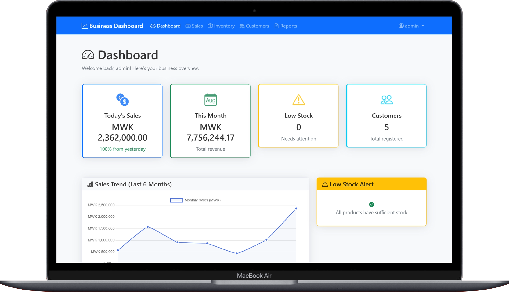
*Main dashboard showing sales charts, inventory status and key metrics*

**Sales Management:**
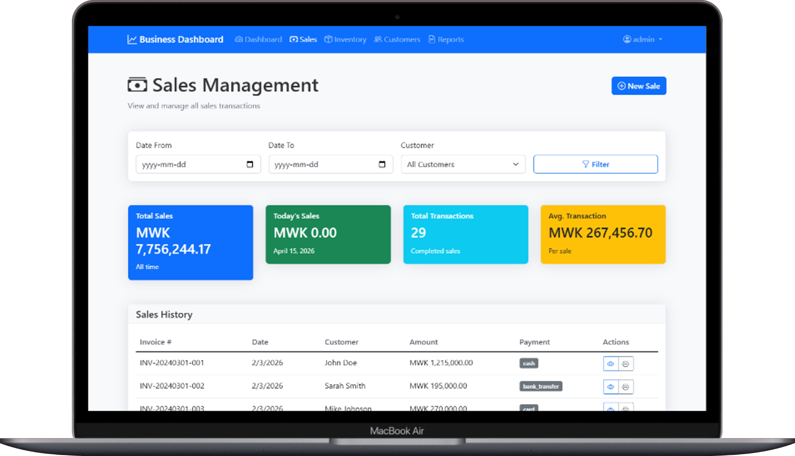
*Complete sales management with filtering, search and data export*

**Inventory Management:**
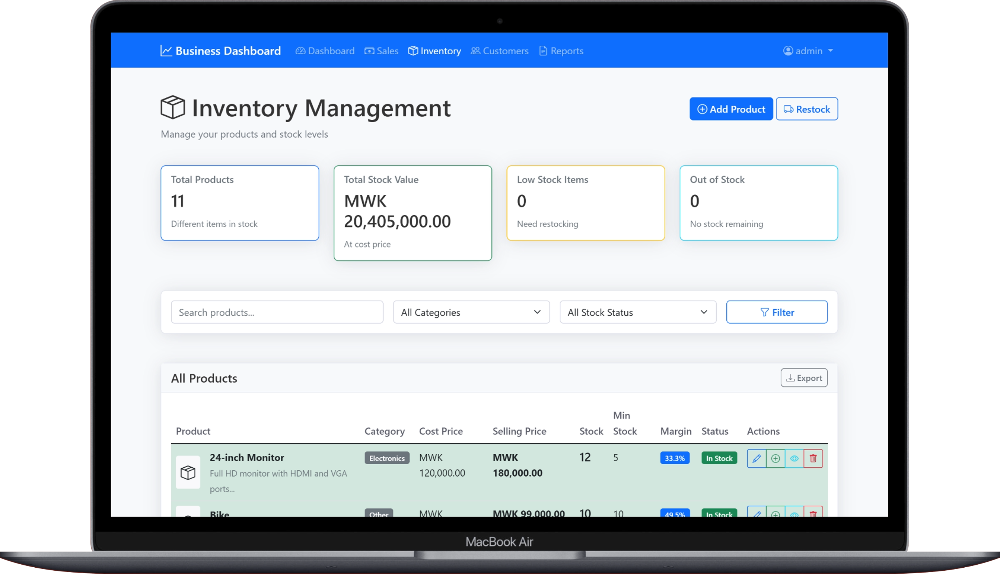
*Full inventory CRUD operations with stock alerts and restocking*

**Customer Management:**
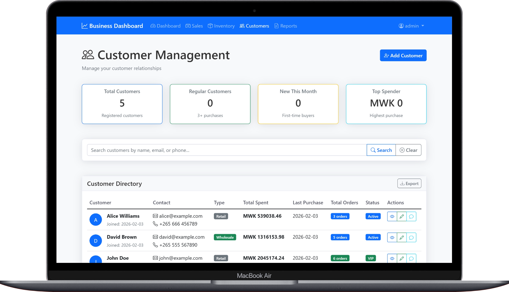
*Customer database with contact information and purchase history*

**Reports & Analytics:**

*Comprehensive business reports and data analysis tools*

**Login Interface:**
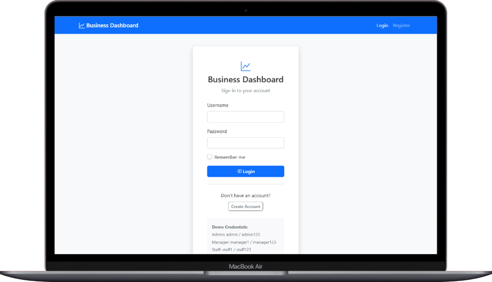
*Secure authentication with role-based access*

### Mobile Screenshots
**Mobile Dashboard:**
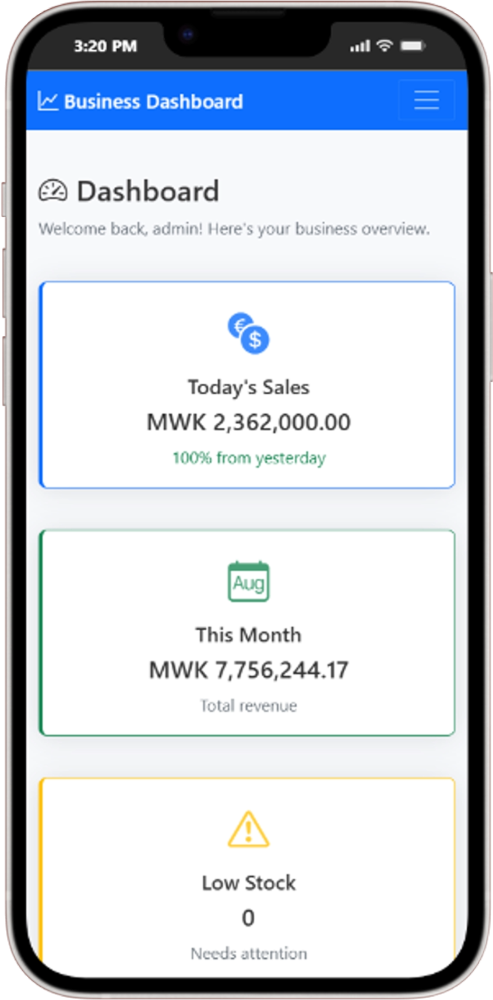
*Responsive dashboard optimized for mobile devices*

**Mobile Sales Management:**
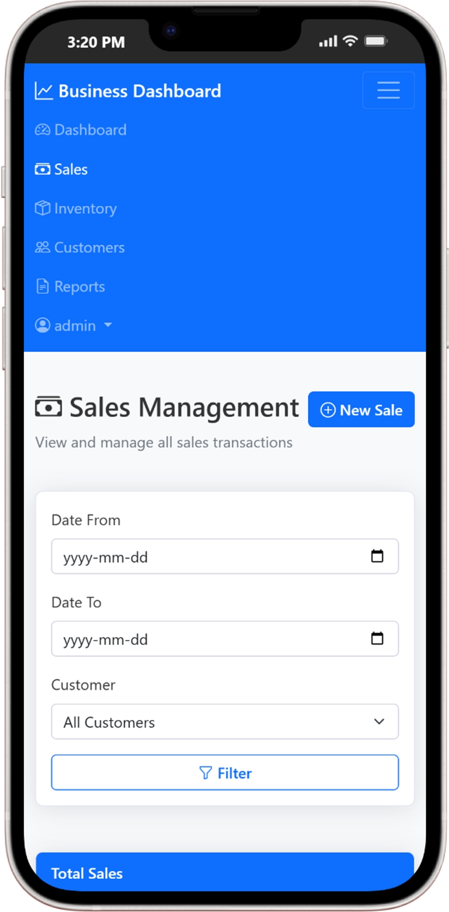
*Sales management interface on mobile devices*

**Mobile Sales Details:**
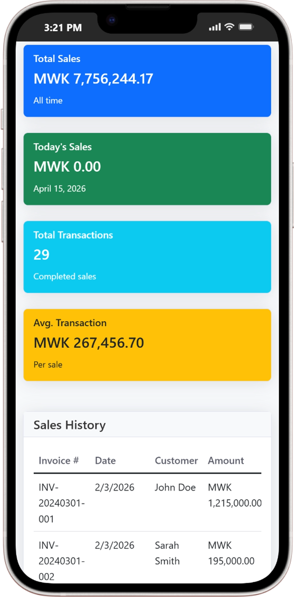
*Detailed sales view with filtering options*

**Mobile Inventory:**
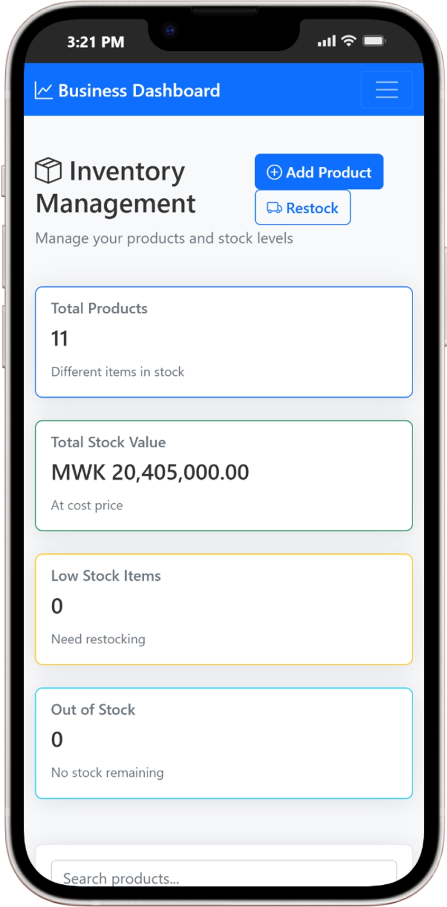
*Inventory management accessible on mobile*

**Mobile Customer View:**
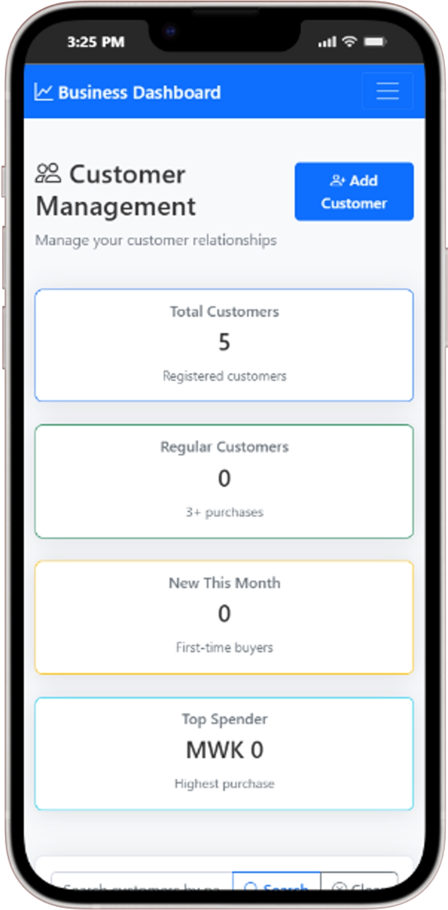
*Customer management on mobile devices*

**Mobile Reports:**
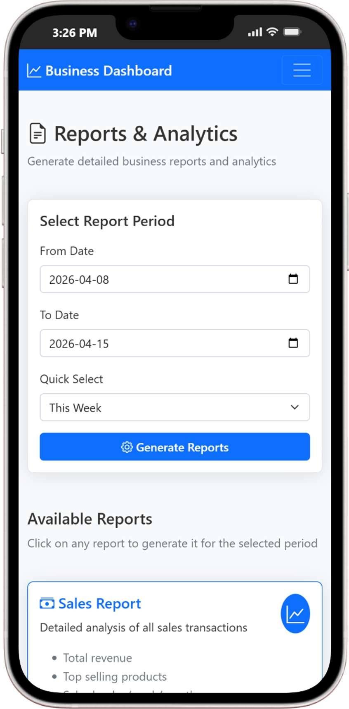
*Business reports accessible on mobile*

**Mobile Reports Details:**
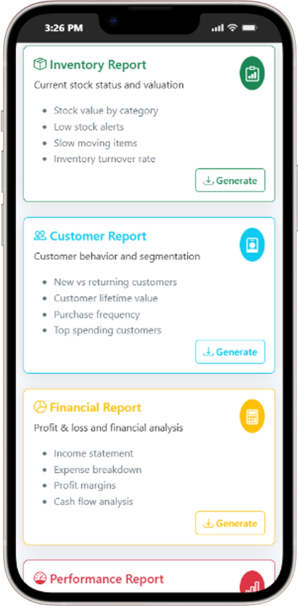
*Detailed analytics and reporting on mobile*

**Mobile Login:**
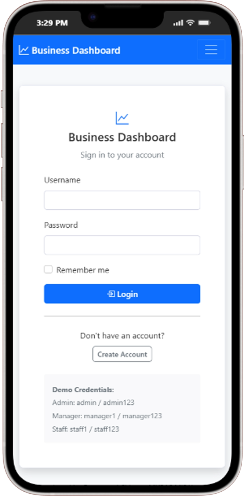
*Mobile-friendly authentication interface*

---

*📸 Screenshots captured from the live application showcasing all major features and mobile responsiveness.*


## 🛠️ How to Set It Up (For Developers)

If you're a student or developer who wants to run this locally:

### What You Need First:
- Python 3.14 or higher
- MySQL installed on your computer
- Git (to download the project)

### Step-by-Step Installation:

```bash
# 1. Get the code
git clone https://github.com/KingKatal/business-intelligence-dashboard.git
cd business-intelligence-dashboard

# 2. Install Python packages
pip install -r requirements.txt

# 3. Make sure WAMP is running and MySQL is available
#    WAMP should show the green icon and MySQL should be up.

# 4. Set up the database and load sample data
python setup_db.py

# 5. Run the application
python run.py

# 6. Open in browser
# Go to: http://localhost:5000

```

Default Login (for testing):
- **Admin:** admin / admin123
- **Manager:** manager1 / manager123
- **Staff:** staff1 / staff123
- **Demo User:** Gomez / gomez123

(Change these immediately if deploying for real use!)


📁 How the Project is Organized

 ```bash
business-intelligence-dashboard/
├── app/                    # Main application folder
│   ├── __init__.py        # Makes this a Python package
│   ├── routes.py          # All website pages and API endpoints
│   ├── models.py          # Database tables structure
│   ├── auth.py            # Login and security
│   └── utils.py           # Helper functions
├── templates/             # HTML pages
│   ├── base.html          # Base template with navigation
│   ├── dashboard.html     # Main dashboard with charts
│   ├── login.html         # Login page
│   ├── sales.html         # Sales management page
│   ├── inventory.html     # Inventory management page
│   ├── customers.html     # Customer management
│   └── reports.html       # Reports and analytics
├── static/               # CSS, JavaScript, images
│   ├── css/
│   │   ├── style.css      # Main stylesheet
│   │   └── dashboard.css  # Dashboard-specific styles
│   ├── js/
│   │   ├── main.js        # Common JavaScript functions
│   │   ├── dashboard.js   # Dashboard charts and updates
│   │   ├── charts.js      # Chart.js configurations
│   │   └── inventory.js   # Inventory management functions
│   └── images/
├── database/             # Database files
│   ├── setup.sql         # Creates tables
│   ├── sampledata.sql    # Example data
│   └── backup_script.py  # Database backup utility
├── screenshots/          # Project screenshots
│   ├── desktop/          # Desktop view screenshots
│   └── mobile/           # Mobile view screenshots
├── tests/               # Testing files
│   ├── test_auth.py     # Login tests
│   ├── test_models.py   # Database model tests
│   └── test_routes.py   # Route tests
├── requirements.txt     # Python packages needed
├── config.py           # Settings (don't share publicly!)
├── run.py              # Starts the application
└── README.md           # This file!
```


🔧 What's Completed ✅

**Core Features:**
- ✅ Basic Flask application with modern Python 3.14
- ✅ Complete database design with MySQL
- ✅ Professional dashboard layout with Bootstrap 5
- ✅ Interactive sales charts and analytics
- ✅ Secure user authentication system
- ✅ Role-based access control (Admin, Manager, Staff)
- ✅ Comprehensive testing suite

**Advanced Features:**
- ✅ Full inventory management with CRUD operations
- ✅ Real-time data updates and filtering
- ✅ CSV export functionality
- ✅ Mobile-responsive design
- ✅ Automated database backups
- ✅ RESTful API endpoints

**Business Intelligence:**
- ✅ Sales trend analysis and forecasting
- ✅ Customer behavior insights
- ✅ Profit margin calculations
- ✅ Stock level monitoring and alerts
- ✅ Financial reporting capabilities

**Coming Soon:**
- Email alerts for low stock
- Customer loyalty tracking
- Advanced expense categorization
- Multi-business support (for franchises)
- API documentation

🤝 Want to Help or Learn?
I'm still learning, so if you see something I could do better:
Found a bug? Open an Issue
Have an idea? Start a Discussion
Want to add code? Make a Pull Request

For fellow MUBAS students:
If you're working on something similar or need help with your projects, feel free to reach out. We can learn together!

🚀 What I've Learned So Far
Building this has taught me:
Planning matters - I spent 2 days just designing the database before writing any code
Small steps win - Instead of building everything at once, I add one feature at a time
Testing saves time - Writing tests feels slow but catches bugs early
Documentation is key - If I don't write it down, I forget why I did something

📚 Challenges I Faced (And How I Solved Them)

**Problem 1: Python 3.14 Compatibility Issues**
Challenge: Password hashing broke when upgrading to Python 3.14
Solution: Updated Flask and Werkzeug versions, regenerated password hashes with proper format

**Problem 2: Making Data Update Live**
Challenge: How to show new sales without refreshing the page
Solution: Used JavaScript to fetch data every 5 minutes with AJAX calls

**Problem 3: Slow Database Queries**
Challenge: Loading all sales history took 10+ seconds
Solution: Added database indexes and cached frequent queries

**Problem 4: Complex Inventory Management**
Challenge: Building full CRUD operations for inventory with real-time updates
Solution: Created comprehensive API endpoints and dynamic JavaScript interface

**Problem 5: Different User Views**
Challenge: Managers need full access, staff need limited view
Solution: Created role-based permissions system with Flask-Login

**Problem 6: Mobile Responsiveness**
Challenge: Ensuring the dashboard works perfectly on phones and tablets
Solution: Used Bootstrap 5 responsive grid system and mobile-first design

🎯 My Goals for This Project
Academic: Demonstrate a deep, practical understanding of full-stack development for my Programming III (CIS-PRO-313) assessment.

Portfolio: Create a substantial, working project that I can show to potential employers or clients as proof of my skills.

Learning: Move from understanding concepts in isolation to knowing how to architect and deploy a complete, integrated system.

Impact: Create a tool that is genuinely useful. If even one small business owner finds it helpful, I'll consider that a huge success.

👨‍💻 About Me
Name: Gomezgani Chirwa

Program: Bachelor of Management Information Systems (Year 3)

University: Malawi University of Business and Applied Sciences (MUBAS)

Focus: I'm passionate about the space where business strategy meets practical technology—figuring out what tools a business actually needs and then building them.

Career Goal: To design and implement information systems that solve real, everyday challenges for businesses and organizations across Africa.

📞 Contact Me:

Email: chirwagomez@gmail.com (personal)

Phone/WhatsApp: +256 880 725 061

LinkedIn: linkedin.com/in/gomezgani-chirwa-4b6286270


💬 Let's Connect!
I'm always happy to:
Chat about tech projects
Help fellow students
Learn from experienced developers
Discuss business technology in Malawi

📄 Important Notes
For Academic Purposes:
This is my original work for educational purposes at MUBAS. All code is written by me unless I specifically credit someone else in the comments.

For Business Use:

This is a learning project and might have bugs. If you want to use it for a real business, please test thoroughly first and consider getting help from an experienced developer.

License:

This project is under the MIT License - meaning you can use, modify and share it, but I'm not responsible if something goes wrong.

<div align="center">
🎓 Student by Day, Coder by Night
"The best way to learn is to build something you care about."

Last Updated: February 2026
Project Status: Actively Developing
Commitment: Daily progress updates

</div> 


